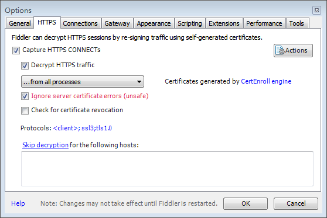
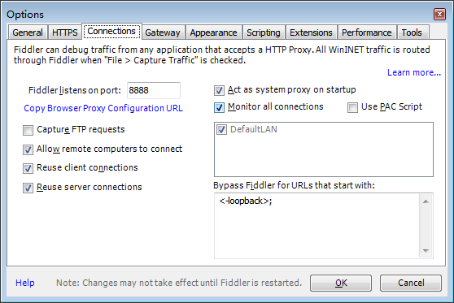
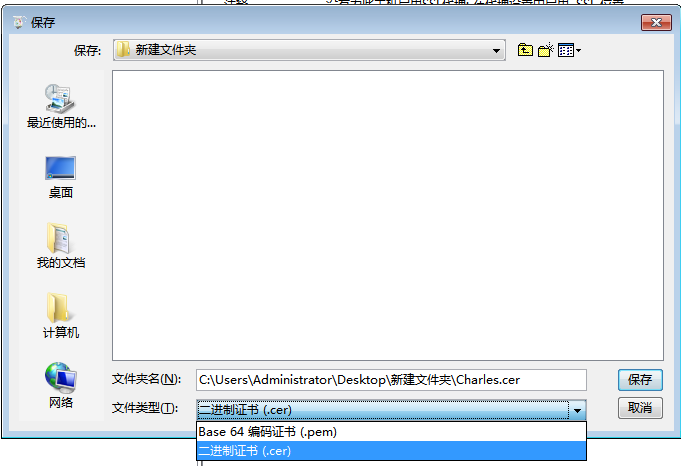

#Android 7.0抓包配置

##Fiddler配置https抓包
1.Fiddler Https抓包设置
- Tools - Options
	
	

2.导出Fiddler的CA证书
点击图一的Actions - Export Root Certificate to Desktop,导出CA证书到桌面

##Charles配置好https的抓包
Charles安装完一般都自动配置好了,所以只要导出Charles的CA证书,放到项目里就可以了
- 帮助 - SSL代理 - 保存Charles根证书
	

**注:需右键点击抓包的域名,对指定的域名开启SSL代理**

##手机和项目配置
3.项目配置
- 将导出的CA证书放入到项目的res/raw目录下
- 创建network_security_config.xml
	```
	<?xml version="1.0" encoding="utf-8"?>
	<network-security-config>
	    <base-config >
	        <trust-anchors>
	            <certificates src="system" />
	            <!--增加一行信任所有用户-->
	<!--            <certificates src="user" />-->
	            <!--这行是增加信任某位用户-->
	            <certificates src="@raw/fiddler_root" />
	        </trust-anchors>
	    </base-config>
	<!--  调试配置  -->
	    <debug-overrides>
	        <trust-anchors>
	            <certificates src="system"/>
	            <certificates src="user"/>
	        </trust-anchors>
	    </debug-overrides>
	
	    <!--只对所配置的服务器放开-->
	    <!--<domain-config>-->
	    <!--<domain includeSubdomains="true">chezhency.com</domain>-->
	    <!--<trust-anchors>-->
	    <!--<certificates src="@raw/chezhency"/>-->
	    <!--</trust-anchors>-->
	    <!--</domain-config>-->
	</network-security-config>
	```
- 配置application
	```
	 <application
        ...
        android:networkSecurityConfig="@xml/network_security_config"
        tools:targetApi="n">
		...
	</application>
	```

4.手机连接局域网wifi,设置代理

**注:放入raw和安装在手机上的CA证书必须是同一个证书**
**注:只有当前统一CA证书的PC端Fiddler可抓包**