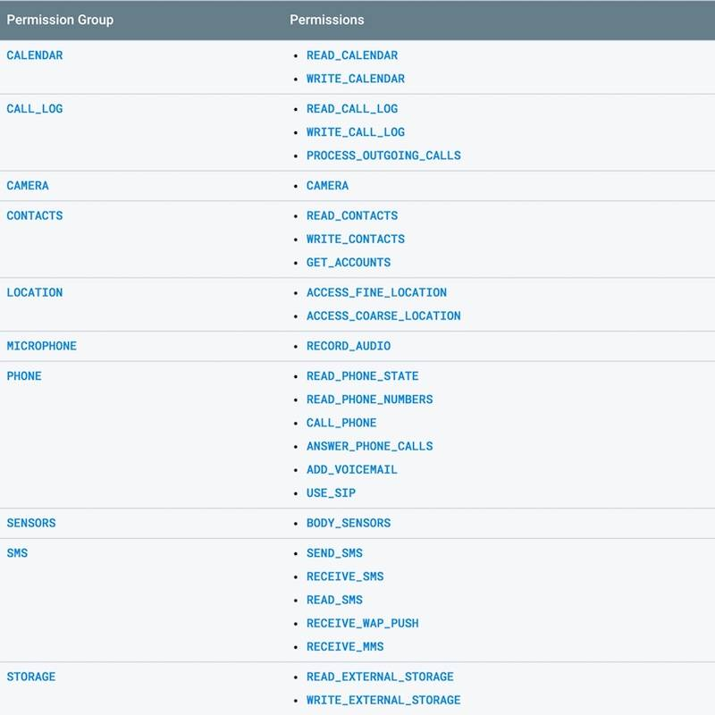
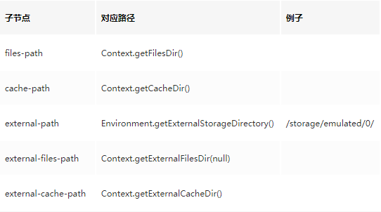

#Android各版本适配

##Android 6.0(M)
**运行时请求权限**


以上是列出9组需要动态申请的权限，建议自己代码统一封装成一个工具类，这里就不细说了， [Android6.0权限工具](https://github.com/tbruyelle/RxPermissions)

##Android 7.0/7.1(N)
**1.应用间共享文件**
  在targetSdkVersion大于等于的24的App中，但是我们没有去适配7.0。那么在调用安装页面，或修改用户头像操作时，就会失败。那么就需要你去适配7.0或是将targetSdkVersion改为24以下（不推荐）。适配的方法这里就不细讲，大家可以看鸿洋大神的
[Android 7.0 行为变更 通过FileProvider在应用间共享文件这篇文章](https://blog.csdn.net/lmj623565791/article/details/72859156)



**2.SharedPreferences闪退**
```
SharedPreferences read = getSharedPreferences(RELEASE_POOL_DATA, MODE_WORLD_READABLE);

//MODE_WORLD_READABLE ：7.0以后不能使用这个获取，会闪退，修改成MODE_PRIVATE
```

##Android 8.0/8.1(O)
**1.安卓8.0中PHONE权限组新增两个权限**
Android 8.0 及以上系统对运行时权限的授予进行了优化,在 Android 8.0 之前，如果应用在运行时请求权限并且被授予该权限，系统会错误地将属于同一权限组并且在清单中注册的其他权限也一起授予应用。对于针对 Android 8.0 的应用，此行为已被纠正。系统只会授予应用明确请求的权限。
```
ANSWER_PHONE_CALLS：允许您的应用通过编程方式接听呼入电话。要在您的应用中处理呼入电话，您可以使用 acceptRingingCall() 函数。
READ_PHONE_NUMBERS ：权限允许您的应用读取设备中存储的电话号码。
```

**2.通知适配**
安卓8.0中，为了更好的管制通知的提醒，不想一些不重要的通知打扰用户，新增了通知渠道，用户可以根据渠道来屏蔽一些不想要的通知

兼容的代码
```
/**
 * 安卓8。0通知的兼容类哦，
 * NotifyCompatYc   yc : 是雨辰的简写，谢谢哦，嘿嘿 ----高贵的子信
 */
public class NotifyCompatYc {

    public static final String QFMD_CHANNEL_ID = "com.oms.mingdeng";
    public static final String QFMD_CHANNEL_NAME = "祈福明燈";
    public static final String LJMS_DEFAULT_CHANNEL_NAME = "靈機妙算";
    public static final String LJMS_CHANNEL_ID = "com.oms.mmcnotity";
    public static final String XYS_CHANNEL_ID = "com.oms.xuyuanshu";
    public static final String XYS_CHANNEL_NAME = "許願樹";

    public static void setONotifyChannel(NotificationManager manager, NotificationCompat.Builder builder, String channeId, String channelName) {
        if (TextUtils.isEmpty(channeId)||TextUtils.isEmpty(channelName)){
            L.e("NotifyCompatYc:  ".concat("安卓8.0的通知兼容库中 channeId 与 channelName 不能为empty"));
        }
        if (Build.VERSION.SDK_INT >= 26) {
            //第三个参数设置通知的优先级别
            NotificationChannel channel =
                    new NotificationChannel(channeId, channelName, NotificationManager.IMPORTANCE_DEFAULT);
            channel.canBypassDnd();//是否可以绕过请勿打扰模式
            channel.canShowBadge();//是否可以显示icon角标
            channel.enableLights(true);//是否显示通知闪灯
            channel.enableVibration(true);//收到小时时震动提示
            channel.setBypassDnd(true);//设置绕过免打扰
            channel.setLockscreenVisibility(NotificationCompat.VISIBILITY_SECRET);
            channel.setLightColor(Color.RED);//设置闪光灯颜色
            channel.getAudioAttributes();//获取设置铃声设置
            channel.setVibrationPattern(new long[]{100, 200, 100});//设置震动模式
            channel.shouldShowLights();//是否会闪光
            if (manager != null) {
                manager.createNotificationChannel(channel);
            }
            if (builder != null) {
                builder.setChannelId(channeId);//这个id参数要与上面channel构建的第一个参数对应
            }
        }
    }

    public static void setONotifyChannel(NotificationManager manager,  String channeId, String channelName) {
        setONotifyChannel(manager,null,channeId,channelName);
    }

    public static Notification getNotification(Context context, String channelId) {
        NotificationCompat.Builder notificationBuilder = new NotificationCompat.Builder(context, channelId);
        Notification notification = notificationBuilder.setOngoing(true)
                .setSmallIcon(R.drawable.ic_launcher)
                .setPriority(NotificationManager.IMPORTANCE_MIN)
                .setCategory(Notification.CATEGORY_SERVICE)
                .build();
        return notification;
    }
}

```
```

public class NotifyManager {

    // 单例开始
    private volatile static NotifyManager INSTANCE;

    private NotifyManager(Context context) {
        initNotifyManager(context);
    }

    public static NotifyManager getInstance(Context context) {
        if (INSTANCE == null) {
            synchronized (NotifyManager.class) {
                if (INSTANCE == null) {
                    INSTANCE = new NotifyManager(context);
                }
            }
        }
        return INSTANCE;
    }
    // 单例结束

    private NotificationManager manager;
   // NotificationManagerCompat
    private NotificationCompat.Builder builder;

    //初始化通知栏配置
    private void initNotifyManager(Context context) {
        context = context.getApplicationContext();
        manager = (NotificationManager) context.getSystemService(Context.NOTIFICATION_SERVICE);
        // 如果存在则清除上一个消息
//        manager.cancel(news_flag);
        builder = new NotificationCompat.Builder(context,NotifyCompatYc.QFMD_CHANNEL_ID);

        NotifyCompatYc.setONotifyChannel(manager,builder,NotifyCompatYc.QFMD_CHANNEL_ID,NotifyCompatYc.QFMD_CHANNEL_NAME);

        // 设置标题
        builder.setContentTitle(context.getResources().getString(R.string.qfmd_notify_title1));
        // 状态栏的动画提醒语句
        builder.setTicker(context.getResources().getString(R.string.qfmd_notify_ticker));
        // 什么时候提醒的
        builder.setWhen(System.currentTimeMillis());
        // 设置通知栏的优先级
        builder.setPriority(Notification.PRIORITY_DEFAULT);
        // 设置点击可消失
        builder.setAutoCancel(true);
        // 设置是否震动等
        builder.setDefaults(Notification.DEFAULT_VIBRATE);
        // 设置icon
        builder.setSmallIcon(R.drawable.lingji_icon);
        // 设置点击意图
        Intent intent = new Intent(context, GongdenggeActivity.class);
        Bundle bundle = new Bundle();
        bundle.putBoolean(Contants.INTENT_GOTO_MYLMAP, true);
        intent.putExtras(bundle);
        intent.setFlags(Intent.FLAG_ACTIVITY_NEW_TASK);
        PendingIntent pendingIntent = PendingIntent.getActivity(context, 230, intent, PendingIntent.FLAG_UPDATE_CURRENT);
        builder.setContentIntent(pendingIntent);
    }

    /**
     * 显示祈福明灯过期通知
     */
    public void showQiFuLampOutOfDateNotify(Context context) {
        // 设置内容
        builder.setContentText(context.getResources().getString(R.string.qfmd_notify_content1));
        manager.notify(13251, builder.build());
    }

    public void showQiFuLampBlessNotify(Context context) {
        builder.setContentText(context.getResources().getString(R.string.qfmd_notify_content2));
        manager.notify(13255, builder.build());
    }
}
```

**3.安装APK**
在 Android 8.0 之前的系统，用户若从官方应用商店之外的来源安装应用时，首先需要在系统设置中打开“允许安装来自未知来源的应用”选项,这是属于全局的设置，打开之后所有的应用都可以随意地弹出应用安装界面来让用户安装. Android 8.0 中删除了这个全局永久授权的选项，用户需要对单个应用的“安装未知来源应用”权限进行授权

首先在AndroidManifest文件中添加安装未知来源应用的权限:
```
<uses-permission android:name="android.permission.REQUEST_INSTALL_PACKAGES"/>
```
这样系统会自动询问用户完成授权。当然你也可以先使用 canRequestPackageInstalls()查询是否有此权限，如果没有的话使用Settings.ACTION_MANAGE_UNKNOWN_APP_SOURCES这个action将用户引导至安装未知应用权限界面去授权。

```
private static final int REQUEST_CODE_UNKNOWN_APP = 100;

    private void installAPK(){

        if (Build.VERSION.SDK_INT >= 26) {
            boolean hasInstallPermission = getPackageManager().canRequestPackageInstalls();
            if (hasInstallPermission) {
                //安装应用
            } else {
                //跳转至“安装未知应用”权限界面，引导用户开启权限
                Uri selfPackageUri = Uri.parse("package:" + this.getPackageName());
                Intent intent = new Intent(Settings.ACTION_MANAGE_UNKNOWN_APP_SOURCES, selfPackageUri);
                startActivityForResult(intent, REQUEST_CODE_UNKNOWN_APP);
            }
        }else {
            //安装应用
        }

    }

    //接收“安装未知应用”权限的开启结果
    @Override
    protected void onActivityResult(int requestCode, int resultCode, Intent data) {
        super.onActivityResult(requestCode, resultCode, data);
        if (requestCode == REQUEST_CODE_UNKNOWN_APP) {
            installAPK();
        }
    }
```

**4.SecurityException的闪退**
项目使用了ActiveAndroid，在 8.0 或 8.1 系统上使用 26 或以上的版本的 SDK 时，调用 ContentResolver 的 notifyChange 方法通知数据更新，或者调用 ContentResolver 的 registerContentObserver 方法监听数据变化时，会出现该异常。
```
1.在清单文件配置
<provider
        android:name="com.activeandroid.content.ContentProvider"
        android:authorities="com.ylmf.androidclient"
        android:enabled="true"
        android:exported="false">
</provider>
2.去掉这个监听刷新的方法，改为广播刷新
```

**5.静态广播无法正常接收**
从 Android 8.0 开始，出于节省电量、提升用户体验等方面的考虑，自定义以及系统大部分的隐式广播将无法被静态注册的 BroadcastReceiver 接收到
解决的方法如下：
- 将静态注册的 BroadcastReceiver 改为动态注册。
- 虽然自定义显示广播不受此限制，但如果要实现隐式广播的效果，让所有注册接收此广播的应用都可以顺利接收到，那么可以通过PackageManager.queryBroadcastReceivers()方法来实现：

```
Intent broadcastIntent = new Intent();
broadcastIntent.setAction("自定义广播Action");

PackageManager packageManager = context.getPackageManager();
List<ResolveInfo> matchList = packageManager.queryBroadcastReceivers(broadcastIntent, 0);
for (ResolveInfo resolveInfo : matchList) {
    Intent intent = new Intent();
    intent.setPackage(resolveInfo.activityInfo.applicationInfo.packageName);
    intent.setAction("自定义广播Action");
    context.sendBroadcast(intent);
}
```

或者
保留原来的静态广播，但是加入Component参数
```
Intent intent =new Intent( "com.example.wenhaibo.androidstudy_broadcast02.MY_BROADCAST" );

intent.setComponent( new ComponentName( "com.example.wenhaibo.androidstudy_broadcast02" ,

        "com.example.wenhaibo.androidstudy_broadcast02.MyBroadCastReceiver") );

sendBroadcast( intent );
```

**6.Caused by: java.lang.IllegalStateException: Only fullscreen opaque activities can request orientation**
Android 8.0 非全屏透明页面不允许设置方向,后面8.1系统谷歌就去掉了这个限制
```
 （1）android:windowIsTranslucent设置为false
  (2)如果还是想用的话，就去掉清单文件中Activity中的android:screenOrientation="portrait"，
  （3）就是使用透明的dialog或者PopupWindow来代替，也可以用DialogFragment，看自己的需求和喜好
```

**7.新的悬浮窗类型**
Android 8.0 之前，应用注册了`SYSTEM_ALERT_WINDOW`权限之后，便可以使用以下类型的悬浮窗：

- TYPE_PHONE
- TYPE_PRIORITY_PHONE
- TYPE_SYSTEM_ALERT
- TYPE_SYSTEM_OVERLAY
- TYPE_SYSTEM_ERROR

而在 Android 8.0 及以上系统，若继续使用以上类型的悬浮窗，就会抛出android.view.WindowManager$BadTokenException异常。因此若想继续在其他应用上显示悬浮窗，就必须使用新的悬浮窗类型TYPE_APPLICATION_OVERLAY，开发者可以通过以下方式进行适配：
```
if (Build.VERSION.SDK_INT >= Build.VERSION_CODES.O) {
    layoutParams.type = WindowManager.LayoutParams.TYPE_APPLICATION_OVERLAY
}else {
    layoutParams.type = WindowManager.LayoutParams.TYPE_SYSTEM_ALERT
}
```

## Android 9.0(P)
**1.限制 HTTP 网络请求**
Android 9.0 中限制了 HTTP（明文传输）网络请求，若仍继续使用HTTP请求，则会在日志中提示以下异常（只是无法正常发出请求，不会导致应用崩溃）：
`java.net.UnknownServiceException: CLEARTEXT communication to xxx not permitted by network security policy`

适配的方法如下：
第一种:
- 在资源目录中新建一个 xml 文件作为网络安全配置文件，例如 xml/network_security_config.xml，然后在文件中填写以下内容：
```
<?xml version="1.0" encoding="utf-8"?>
<network-security-config>
    <base-config cleartextTrafficPermitted="true" />
</network-security-config>
```
- 在AndroidManifest.xml进行配置：
```
<application
    ...
    android:networkSecurityConfig="@xml/network_security_config">
    ...
</application>
```

第二种:
Android 6.0 中引入了是否允许网络使用明文传输的配置：
```
<application android:usesCleartextTraffic=["true" | "false"]>
```
原来默认为 true，但在 Android 9.0 中默认值改为了 false，因此将配置手动设为 true 即可解决明文传输被限制的问题

**2.弃用 Apache HTTP Client**
由于官方在 Android 9.0 中移除了所有 Apache HTTP Client 相关的类，因此我们的应用或是一些第三方库如果使用了这些类，就会抛出找不到类的异常：
`java.lang.NoClassDefFoundError: Failed resolution of: Lorg/apache/http/conn/scheme/SchemeRegistry;
`
若需要继续使用 Apache HTTP Client ，可通过以下方法进行适配：
- 在 AndroidManifest.xml 中添加以下内容：
```
<application
    ...
   <uses-library android:name="org.apache.http.legacy" android:required="false"/>
    ...
</application>
```
- 或者在应用中直接将 Apache HTTP Client 相关的类打包并进行引用

**3. 限制非 SDK 接口的调用**
一直以来，官方提供的接口分为了 SDK 接口和非 SDK 接口。SDK 接口即官方支持的接口，开发者可以直接调用不会有任何限制。一般而言，SDK 接口都记录在官方的接口索引中，没有记录的就视为非 SDK 接口，例如一些使用了 @hide 标注的方法。

**4. 前台服务权限**
在 Android 9.0 中，应用在使用前台服务之前必须先申请 FOREGROUND_SERVICE 权限，否则就会抛出 SecurityException 异常。
此外，由于 FOREGROUND_SERVICE 权限只是普通权限，因此开发者只需在 AndroidManifest.xml 中注册此权限即可，系统会自动对此权限进行授权：
```
<uses-permission android:name="android.permission.FOREGROUND_SERVICE" />
```

**5. 强制执行 FLAG_ACTIVITY_NEW_TASK 要求**
在 Android 7.0（API 级别 24）之前，若开发者需要通过非 Activity context 启动 Activity，就必须设置 Intent 标志 FLAG_ACTIVITY_NEW_TASK，否则会启动失败并抛出以下异常
```
android.util.AndroidRuntimeException: Calling startActivity() from outside of an Activity  context requires the FLAG_ACTIVITY_NEW_TASK flag. Is this really what you want?
```
但这个要求在更新 Android 7.0 以后由于系统问题被临时取消了，开发者即使不设置标志也可以正常启动 Activity。而在 Android 9.0 中官方修复了这个问题，这个要求重新开始强制执行，因此开发者在适配 Android 9.0 时需要注意这个问题。

**6. 不允许共享 WebView 数据目录**
Android 9.0 中为了改善应用稳定性和数据完整性，应用无法再让多个进程共用同一 WebView 数据目录。此类数据目录一般存储 Cookie、HTTP 缓存以及其他与网络浏览有关的持久性和临时性存储。
如果开发者需要在多进程中使用 WebView，则必须先调用 WebView.setDataDirectorySuffix() 方法为每个进程设置用于存储 WebView 数据的目录。若多进程 WebView 之间需要共享数据，开发者需自己通过 IPC 的方式实现。
此外，若开发者只想在一个进程中使用 WebView，并且希望严格执行这个规则，可以通过在其他进程中调用 WebView.disableWebView() 方法，这样其他进程创建 WebView 实例就会抛出异常。

**7.java.lang.IllegalArgumentException: Invalid Region.Op - only INTERSECT and DIFFERENCE are allowed**
```
	if (Build.VERSION.SDK_INT >= 26) {
	    canvas.clipPath(mPath);
	} else {
	    canvas.clipPath(mPath, Region.Op.REPLACE);
	}
```

## Android 10

**requestLegacyExternalStorage 的前提下得到结论（官方还没完全开启限制的前提）：**
1、targetSDK 用 28 编译的在 Android 10 上还是可以读取到全部文件，之后覆盖安装一个使用 targetSDK 29 的，还能继续可以访问全路径。
2、卸载后直接用 targetSDK 29 编译的会读取不到。


**1.Region.Op相关异常：java.lang.IllegalArgumentException: Invalid Region.Op - only INTERSECT and DIFFERENCE are allowed**
当 targetSdkVersion >= Build.VERSION_CODES.P 时调用 canvas.clipPath(path, Region.Op.XXX); 引起的异常.
解决方案如下，用Path.op代替，先运算Path，再给canvas.clipPath：
```
	if(Build.VERSION.SDK_INT >= Build.VERSION_CODES.P){
    Path mPathXOR = new Path();
    mPathXOR.moveTo(0,0);
    mPathXOR.lineTo(getWidth(),0);
    mPathXOR.lineTo(getWidth(),getHeight());
    mPathXOR.lineTo(0,getHeight());
    mPathXOR.close();
    //以上根据实际的Canvas或View的大小，画出相同大小的Path即可
    mPathXOR.op(mPath0, Path.Op.XOR);
    canvas.clipPath(mPathXOR);
	}else {
	    canvas.clipPath(mPath0, Region.Op.XOR);
	}
```
**2.Android Q(10)中的媒体资源读写**
1、扫描系统相册、视频等，图片、视频选择器都是通过ContentResolver来提供，主要代码如下：
```
	private static final String[] IMAGE_PROJECTION = {
	            MediaStore.Images.Media.DATA,
	            MediaStore.Images.Media.DISPLAY_NAME,
	            MediaStore.Images.Media._ID,
	            MediaStore.Images.Media.BUCKET_ID,
	            MediaStore.Images.Media.BUCKET_DISPLAY_NAME};
	
	 Cursor imageCursor = mContext.getContentResolver().query(
	                    MediaStore.Images.Media.EXTERNAL_CONTENT_URI,
	                    IMAGE_PROJECTION, null, null, IMAGE_PROJECTION[4] + " DESC");
	
	String path = imageCursor.getString(imageCursor.getColumnIndexOrThrow(IMAGE_PROJECTION[0]));
	String name = imageCursor.getString(imageCursor.getColumnIndexOrThrow(IMAGE_PROJECTION[1]));
	int id = imageCursor.getInt(imageCursor.getColumnIndexOrThrow(IMAGE_PROJECTION[2]));
	String folderPath = imageCursor.getString(imageCursor.getColumnIndexOrThrow(IMAGE_PROJECTION[3]));
	String folderName = imageCursor.getString(imageCursor.getColumnIndexOrThrow(IMAGE_PROJECTION[4]));
	
	//Android Q 公有目录只能通过Content Uri + id的方式访问，以前的File路径全部无效，如果是Video，记得换成MediaStore.Videos
	if(Build.VERSION.SDK_INT >= Build.VERSION_CODES.Q){
	      path  = MediaStore.Images.Media
	                       .EXTERNAL_CONTENT_URI
	                       .buildUpon()
	                       .appendPath(String.valueOf(id)).build().toString();
	 }
```
2、判断公有目录文件是否存在，自Android Q开始，公有目录File API都失效，不能直接通过new File(path).exists();判断公有目录文件是否存在，正确方式如下：
```
	public static boolean isAndroidQFileExists(Context context, String path){
	        if (context == null) {
	            return false;
	        }
	        AssetFileDescriptor afd = null;
	        ContentResolver cr = context.getContentResolver();
	        try {
	            Uri uri = Uri.parse(path);
	            afd = cr.openAssetFileDescriptor(Uri.parse(path), "r");
	            if (afd == null) {
	                return false;
	            } else {
	                close(afd);
	            }
	        } catch (FileNotFoundException e) {
	            return false;
	        }finally {
	            close(afd);
	        }
	        return true;
	}
```
3、保存或者下载文件到公有目录，保存Bitmap同理，如Download，MIME_TYPE类型可以自行参考对应的文件类型，这里只对APK作出说明
```
	public static void copyToDownloadAndroidQ(Context context, String sourcePath, String fileName, String saveDirName){
	        ContentValues values = new ContentValues();
	        values.put(MediaStore.Downloads.DISPLAY_NAME, fileName);
	        values.put(MediaStore.Downloads.MIME_TYPE, "application/vnd.android.package-archive");
	        values.put(MediaStore.Downloads.RELATIVE_PATH, "Download/" + saveDirName.replaceAll("/","") + "/");
	
	        Uri external = MediaStore.Downloads.EXTERNAL_CONTENT_URI;
	        ContentResolver resolver = context.getContentResolver();
	
	        Uri insertUri = resolver.insert(external, values);
	        if(insertUri == null) {
	            return;
	        }
	
	        String mFilePath = insertUri.toString();
	
	        InputStream is = null;
	        OutputStream os = null;
	        try {
	            os = resolver.openOutputStream(insertUri);
	            if(os == null){
	                return;
	            }
	            int read;
	            File sourceFile = new File(sourcePath);
	            if (sourceFile.exists()) { // 文件存在时
	                is = new FileInputStream(sourceFile); // 读入原文件
	                byte[] buffer = new byte[1444];
	                while ((read = is.read(buffer)) != -1) {
	                    os.write(buffer, 0, read);
	                }
	                is.close();
	                os.close();
	            }
	        } catch (Exception e) {
	            e.printStackTrace();
	        }
	        finally {
	            close(is,os);
	        }
	
	}
```
4、保存图片相关
```
	 /**
	     * 通过MediaStore保存，兼容AndroidQ，保存成功自动添加到相册数据库，无需再发送广告告诉系统插入相册
	     *
	     * @param context      context
	     * @param sourceFile   源文件
	     * @param saveFileName 保存的文件名
	     * @param saveDirName  picture子目录
	     * @return 成功或者失败
	     */
	    public static boolean saveImageWithAndroidQ(Context context,
	                                                  File sourceFile,
	                                                  String saveFileName,
	                                                  String saveDirName) {
	        String extension = BitmapUtil.getExtension(sourceFile.getAbsolutePath());
	
	        ContentValues values = new ContentValues();
	        values.put(MediaStore.Images.Media.DESCRIPTION, "This is an image");
	        values.put(MediaStore.Images.Media.DISPLAY_NAME, saveFileName);
	        values.put(MediaStore.Images.Media.MIME_TYPE, "image/png");
	        values.put(MediaStore.Images.Media.TITLE, "Image.png");
	        values.put(MediaStore.Images.Media.RELATIVE_PATH, "Pictures/" + saveDirName);
	
	        Uri external = MediaStore.Images.Media.EXTERNAL_CONTENT_URI;
	        ContentResolver resolver = context.getContentResolver();
	
	        Uri insertUri = resolver.insert(external, values);
	        BufferedInputStream inputStream = null;
	        OutputStream os = null;
	        boolean result = false;
	        try {
	            inputStream = new BufferedInputStream(new FileInputStream(sourceFile));
	            if (insertUri != null) {
	                os = resolver.openOutputStream(insertUri);
	            }
	            if (os != null) {
	                byte[] buffer = new byte[1024 * 4];
	                int len;
	                while ((len = inputStream.read(buffer)) != -1) {
	                    os.write(buffer, 0, len);
	                }
	                os.flush();
	            }
	            result = true;
	        } catch (IOException e) {
	            result = false;
	        } finally {
	            Util.close(os, inputStream);
	        }
	        return result;
	}
```
**4.EditText默认不获取焦点，不自动弹出键盘**
```
	mEditText.post(() -> {
       mEditText.requestFocus();
       mEditText.setFocusable(true);
       mEditText.setFocusableInTouchMode(true);
	});
```


## Android 10/11 存储适配建议

**适配核心**

分区存储是核心，App自身产生的文件应该存放在自己的目录下：

> /sdcard/Android/data/packagename/ 和/data/data/packagename/

这两个目录本App无需申请访问权限即可申请，其它App无法访问本App的目录。

**适配共享存储**

共享存储空间里的文件需要通过Uri构造输入输出流访问，Uri获取方式有两种：MediaStore和SAF。

**适配其它目录**

在Android 11上需要申请访问所有文件的权限。

### **具体做法**

**第一步**

在AndroidManifest.xml里添加如下字段：
权限声明：

```xml
<uses-permission android:name="android.permission.WRITE_EXTERNAL_STORAGE" /> <uses-permission android:name="android.permission.READ_EXTERNAL_STORAGE" /> <uses-permission android:name="android.permission.MANAGE_EXTERNAL_STORAGE" />
```

在<application>标签下添加如下字段：

```xml
android:requestLegacyExternalStorage="true"
```

**第二步**

如果需要访问共享存储空间，则判断运行设备版本是否大于等于Android6.0，若是则需要申请WRITE_EXTERNAL_STORAGE 权限。拿到权限后，通过Uri访问共享存储空间里的文件。
如果需要访问其它目录，则通过SAF访问

**第三步**

如果想要做文件管理器、病毒扫描管理器等功能。则判断运行设备版本是否大于等于Android 6.0，若是先需要申请普通的存储权。若运行设备版本为Android 10.0，则可以直接通过路径访问/sdcard/目录下文件(因为禁用了分区存储)；若运行设备版本为Android 11.0，则需要申请MANAGE_EXTERNAL_STORAGE 权限。

以上是Android 存储权限适配的全部内容。

本篇基于Android 10.0 11.0 。Android 10.0真机、Android 11.0模拟器
测试代码(https://github.com/fishforest/AndroidDemo/tree/main/app/src/main/java/com/example/androiddemo/storagepermission)


## 另外适配

**1.全屏适配**

```xml
<application>
<meta-data 
        android:name="android.max_aspect"
        android:value="2.1"/>
</application>
```

**2.Android 8.0的应用图标适配**
使用AndroidStudio的ImageAsset工具生成图标

资料内容:
[Android6.0～9.0适配](https://juejin.im/post/5beaf27fe51d45332a4568e9)
[Android10适配](https://juejin.im/post/5e564367e51d4526e807f0e4?utm_source=gold_browser_extension)
[Android 版本适配：8.x Oreo（API 级别 26、27）](https://juejin.im/post/5cbc13696fb9a06886421c40)
[Android 版本适配：9.0 Pie（API 级别 28）](https://juejin.im/post/5cbc146751882541625684bd?utm_source=gold_browser_extension)
[Android 10、11 存储完全适配](https://mp.weixin.qq.com/s/rRltWQZORbbfAe8LjTpdSQ)