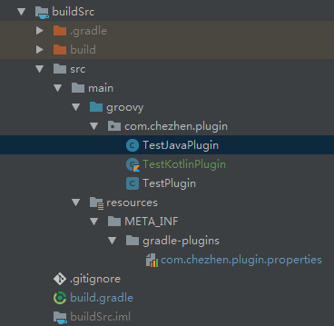

##自定义Gradle Plugin

1.在项目根目录下创建名称为buildSrc的library Module

2.修改项目目录结构

3.修改build.gradle文件
    //Groovy Plugin 方式
	apply plugin: 'groovy'
	
	dependencies {
	    implementation gradleApi()
	    implementation localGroovy()
	}
	
	
	//Kotlin Plugin 方式
	//apply plugin: 'groovy'
	//apply plugin: 'kotlin'
	//
	//dependencies {
	//    implementation gradleApi()
	//    compile "org.jetbrains.kotlin:kotlin-stdlib:$kotlin_version"
	//}
	//buildscript {
	//    ext.kotlin_version = '1.2.71'
	//    repositories {
	//        mavenCentral()
	//    }
	//    dependencies {
	//        classpath "org.jetbrains.kotlin:kotlin-gradle-plugin:$kotlin_version"
	//    }
	//}
	//
	//repositories {
	//    mavenCentral()
	//}
	
	
	//JavaPlugin方式
	//plugins{
	//    id 'java-gradle-plugin'
	//}
	//
	//apply plugin: 'maven'
	//
	//repositories{
	//    mavenCentral()
	//}
	
	//gradlePlugin {
	//    plugins{
	//        javaPlugin{
	//            id = 'com.chezhen.plugin'
	//            implementationClass = 'com.chezhen.plugin.TestJavaPlugin'
	//        }
	//    }
	//}
	
	
	//发布Plugin
	//apply plugin: 'maven'
	//
	//group='com.tb.plugin'
	//version='1.0.0'
	//archivesBaseName='module-plugin'
	//
	//uploadArchives{
	//    repositories {
	//        mavenDeployer{
	//            repository(url: uri('../tbModulePlugin'))//发布地址,可以是远程或本地
	//        }
	//    }
	//}
	
	// 或
	
	//apply plugin: 'maven-publish'
	//
	//publishing {
	//    publications {
	//        maven(MavenPublication) {
	//            groupId 'com.tb.plugin'
	//            artifactId 'kotlin-plugin'
	//            version '1.0.0'
	//
	//            from components.java
	//        }
	//    }
	//
	//    repositories {
	//        ivy {
	//            url "../consuming/ivy-repo"
	//        }
	//        maven {
	//            url="../tbModulePlugin"
	//        }
	//    }
	//}

4.创建'packagename-***Plugin.properties'文件
内容`implementation-class=packagename.**Plugin`

5.再包名目录下创建***Plugin文件(可以是.java/.groovy/.kt)

6.使用对应文件的语言开始编写自定义脚本功能

7.引用脚本
apply plugin: packagename.**Plugin(使用这种方式可以不要resources文件)

使用properties文件配置的名称关联不了????

另: 上传到本地maven仓库

    apply plugin: 'maven'
	
	group='com.tb.plugin'
	version='1.0.0'
	archivesBaseName='module-plugin'
	
	uploadArchives{
	    repositories {
	        mavenDeployer{
	            repository(url: uri('../tbModulePlugin'))
	        }
	    }
	}